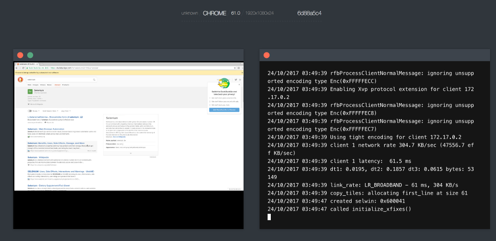

# WebSummoner
[](https://github.com/WebSummoner/websummoner/actions/workflows/build.yml)
[](https://github.com/WebSummoner/websummoner/actions/workflows/lint.yml)
[](https://codecov.io/gh/websummoner/websummoner)
[](https://github.com/WebSummoner/websummoner/releases/latest)
[](https://hub.docker.com/r/websummoner/websummoner)

**WebSummoner is developed and maintained by [RIADVICE](https://riadvice.com)** — a Selenium hub updated with current Go toolchains, modern browser images and community fixes.

WebSummoner is a powerful implementation of [Selenium](http://github.com/SeleniumHQ/selenium) hub using [Docker](https://docker.com/) containers to launch browsers.


## Features

### One-command Installation
Start browser automation in minutes by downloading [Configuration Manager](https://github.com/WebSummoner/cm/releases) binary and running just **one command**:
```
$ ./cm websummoner start --vnc --tmpfs 128
```
The legacy `cm selenoid` subcommand is still accepted.
**That's it!** You can now use WebSummoner instead of Selenium server. Specify the following Selenium URL in tests:
```
http://localhost:4444/wd/hub
```

### Ready to use Browser Images
No need to manually install browsers or dive into WebDriver documentation. Available images:


New images are added right after official releases. You can create your custom images with browsers.

### Live Browser Screen and Logs
New **[rich user interface](https://github.com/WebSummoner/websummoner-ui)** showing browser screen and Selenium session logs:


### Video Recording
* Any browser session can be saved to [H.264](https://en.wikipedia.org/wiki/H.264/MPEG-4_AVC) video ([example](https://www.youtube.com/watch?v=maB298oO5cI))
* An API to list, download and delete recorded video files

### Convenient Logging

* Any browser session logs are automatically saved to files - one per session
* An API to list, download and delete saved log files

### Lightweight and Lightning Fast
Suitable for personal usage and in big clusters:
* Consumes **10 times** less memory than Java-based Selenium server under the same load
* **Small 6 Mb binary** with no external dependencies (no need to install Java)
* **Browser consumption API** working out of the box
* Ability to send browser logs to **centralized log storage** (e.g. to the [ELK-stack](https://logz.io/learn/complete-guide-elk-stack/))
* Fully **isolated** and **reproducible** environment

### Detailed Documentation
* Detailed [documentation](https://websummoner.github.io/websummoner/) — built from [`docs-site/`](docs-site/) with [Astro Starlight](https://starlight.astro.build), deployed to GitHub Pages by the custom `docs` workflow
* Compatible with the vast [Selenoid](https://stackoverflow.com/questions/tagged/selenoid) community knowledge on StackOverflow

## Complete Guide & Build Instructions

Complete reference guide (including building instructions) lives at [websummoner.github.io/websummoner](https://websummoner.github.io/websummoner/) (source: [`docs-site/`](docs-site/)).

Building requires **only Docker** — no Go installation on your machine:
```
$ docker run --rm -v "$PWD":/app -w /app golang:1.27-trixie \
      go test -tags 's3 metadata' -race ./...
```

## Migrating from Selenoid

WebSummoner keeps backwards compatibility with Selenoid client-facing APIs:
* The legacy `selenoid:options` capability prefix is still accepted (the new `websummoner:options` takes precedence when both are set)
* The legacy `X-Selenoid-No-Wait` and `X-Selenoid-File` headers and the `/aerokube/...` proxy path fragment still work
* Inside the Docker image the configuration file moved from `/etc/selenoid/browsers.json` to `/etc/websummoner/browsers.json` (override with the `-conf` flag or your own entrypoint)

## WebSummoner in Kubernetes

WebSummoner was initially created to be deployed on hardware servers or virtual machines and is not suitable for Kubernetes.

## Known Users

WebSummoner runs browser automation for engineering teams all over the world — from startups to Fortune 500 companies — and workflows built for its compatible predecessors carry over unchanged:

[](http://jetbrains.com/) [](https://yandex.com/company/) [](http://sber-tech.com/) [](https://thoughtworks.com/) [](https://vk.com/) [](http://superjob.ru/) [](http://propellerads.com/) [](https://alfabank.com/) [](https://www.3cx.com/) [](https://iqoption.com/) [](https://corp.mail.ru/en/) [](http://newegg.com/) [](https://badoo.com/team/) [](https://bcs.ru/) [](https://quality-lab.ru) [](https://www.at-consulting.ru/) [](https://www.royalcaribbean.com/) [](https://sixt.com/) [](http://www.testjar.com/) [](https://www.flipdish.com/) [](https://riadvice.com/)

## License

Apache 2.0 — see [LICENSE](LICENSE).
